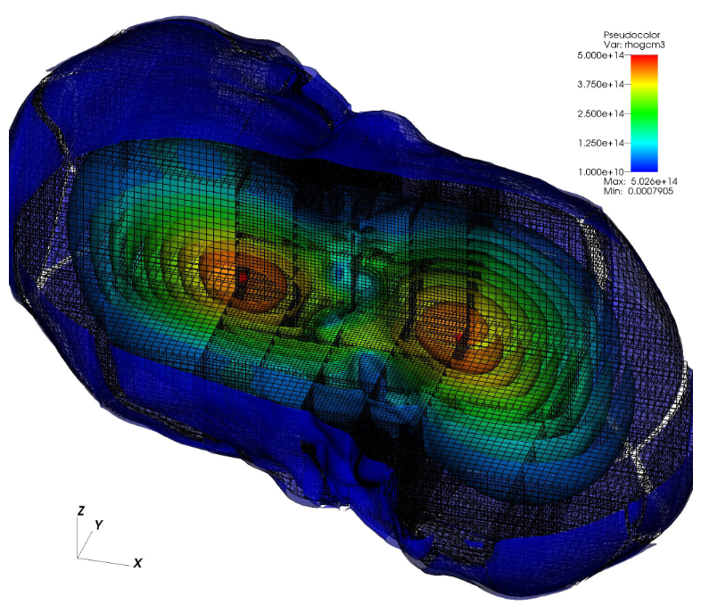

**UNDER CONSTRUCTION**

## About

[GR-Athena++](https://github.com/computationalrelativity/grathena) is a scalable code for 3+1 numerical relativity refactored from the [Athena++](https://www.athena-astro.app/index.html) magnetohydrodynamics code and adaptive mesh refinement (AMR) framework. The main features of the code are

 * Support for [vertex-centered](https://arxiv.org/abs/2101.08289) and [cell-centered](https://arxiv.org/abs/2406.09139) for spacetime variables;
 * Dynamical spacetime solver based on the [Z4c](https://arxiv.org/abs/0912.2920) formulation of 3+1 general relativity and high-order operators;
 * GRMHD solver on dynamical spacetimes, based on the Valencia formulation and Athena++ constrained transport algorithm;
 * Radiation transport solver on dynamical spacetimes based on the [M1 formulation](https://arxiv.org/abs/2111.14858);
 * Support for various equations of state, including tabular microphysical models;
 * Various adaptive mesh refinement algorithms for black hole evolutions in the puncture framework;
 * Gravitational-wave extraction;
 * Apparent horizon finder.

GR-Athena++ is developed by the Computational Relativity (CoRe) collaboration at Jena (Germany) and Penn State (USA).

## Open source

The code is developed open source, the latest version can be retrived from the [repository](https://github.com/computationalrelativity/grathena) by 

```
git clone https://github.com/computationalrelativity/grathena
```

## Terms of use

The code is distributed in the hope that it will be useful, but without any warranty or support. If you use the code for your research, please cite the relevant method papers listed below.

For reporting potential performance or correctness bugs in the code and algorithm, please open a detailed GitHub Issue. High quality pull requests for bugfixes or new features are accepted on a case-by-case basis. Please contact the relevant code maintainer(s) before expending too much effort on a lengthy PR.

## Method papers

 * [GR-Athena++: Puncture Evolutions on Vertex-centered Oct-tree Adaptive Mesh Refinement](https://arxiv.org/abs/2101.08289) Daszuta B., Zappa F., Cook W., Radice D., Bernuzzi S., and Morozova V. Astrophys.J.Supp. 257 (2021) 2, 25 [bib](https://ui.adsabs.harvard.edu/abs/2021ApJS..257...25D/exportcitation)
 * [GR-Athena++: General-relativistic magnetohydrodynamics simulations of neutron star spacetimes](https://arxiv.org/abs/2311.04989) Cook W., Daszuta B., Fields J., Hammond P., Albanesi S., Zappa F., Bernuzzi S., and Radice D. Astrophys.J.Supp. XXX (2024) XX, XXX [bib](https://ui.adsabs.harvard.edu/abs/2023arXiv231104989C/exportcitation)
 * [Numerical relativity simulations of compact binaries: comparison of cell- and vertex-centered adaptive meshes](https://arxiv.org/abs/2406.09139) Daszuta B., Cook W., Hammond P., Fields J., Gutiérrez E.M., Bernuzzi S., Radice D. Physical Review D, XXX [bib](https://ui.adsabs.harvard.edu/abs/2024arXiv240609139D/exportcitation)

## Funding

The development of GR-Athena++ was supported by the EU H2020 under ERC Starting Grant, no.~BinGraSp-714626 (PI Bernuzzi), the EU Horizon under ERC Consolidator Grant, no. InspiReM-101043372 (PI Bernuzzi), ...





## Notes

Text can be **bold**, _italic_, or ~~strikethrough~~.

[Link to another page](./another-page.html).

There should be whitespace between paragraphs.

There should be whitespace between paragraphs. We recommend including a README, or a file with information about your project.

# Header 1

This is a normal paragraph following a header. GitHub is a code hosting platform for version control and collaboration. It lets you and others work together on projects from anywhere.

## Header 2

> This is a blockquote following a header.
>
> When something is important enough, you do it even if the odds are not in your favor.

### Header 3

```js
// Javascript code with syntax highlighting.
var fun = function lang(l) {
  dateformat.i18n = require('./lang/' + l)
  return true;
}
```

```ruby
# Ruby code with syntax highlighting
GitHubPages::Dependencies.gems.each do |gem, version|
  s.add_dependency(gem, "= #{version}")
end
```

#### Header 4

*   This is an unordered list following a header.
*   This is an unordered list following a header.
*   This is an unordered list following a header.

##### Header 5

1.  This is an ordered list following a header.
2.  This is an ordered list following a header.
3.  This is an ordered list following a header.

###### Header 6

| head1        | head two          | three |
|:-------------|:------------------|:------|
| ok           | good swedish fish | nice  |
| out of stock | good and plenty   | nice  |
| ok           | good `oreos`      | hmm   |
| ok           | good `zoute` drop | yumm  |

### There's a horizontal rule below this.

* * *

### Here is an unordered list:

*   Item foo
*   Item bar
*   Item baz
*   Item zip

### And an ordered list:

1.  Item one
1.  Item two
1.  Item three
1.  Item four

### And a nested list:

- level 1 item
  - level 2 item
  - level 2 item
    - level 3 item
    - level 3 item
- level 1 item
  - level 2 item
  - level 2 item
  - level 2 item
- level 1 item
  - level 2 item
  - level 2 item
- level 1 item

### Large image


### Definition lists can be used with HTML syntax.

<dl>
<dt>Name</dt>
<dd>Godzilla</dd>
<dt>Born</dt>
<dd>1952</dd>
<dt>Birthplace</dt>
<dd>Japan</dd>
<dt>Color</dt>
<dd>Green</dd>
</dl>

```
Long, single-line code blocks should not wrap. They should horizontally scroll if they are too long. This line should be long enough to demonstrate this.
```

```
The final element.
```
